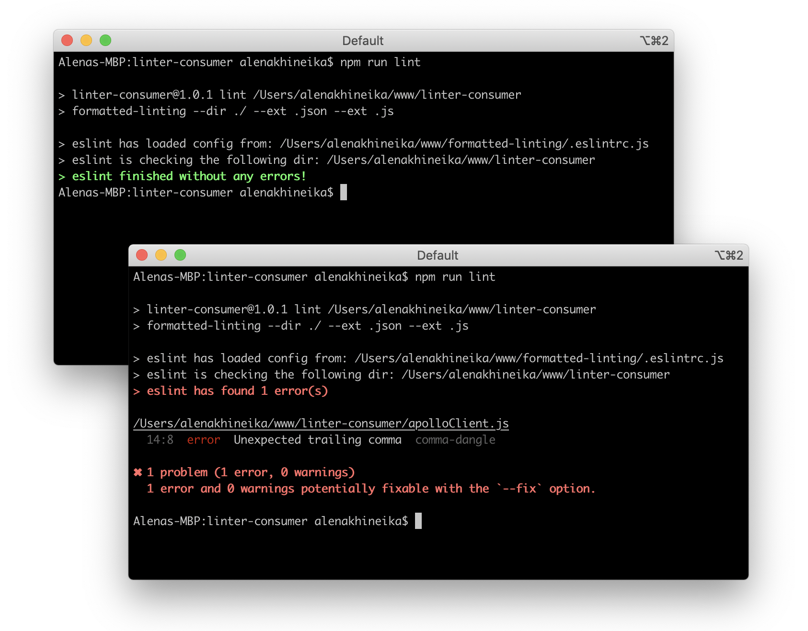

# formatted-linting

The `formatted-linting` is based on [CLIEngine API](https://eslint.org/docs/developer-guide/nodejs-api#cliengine) and does only one thing - prints a friendly message when ESLint has finished without any errors.



This is sample project from [How to format ESLint output](https://medium.com/) blogpost, therefore it won't be published at npm.

To run it locally use npm package linking mechanism.

```
cd ~/projects/formatted-linting              # go into the package directory
npm link                                     # creates global link
cd ~/projects/linter-consumer                # go into some other package directory.
npm link /Users/alena/www/formatted-linting  # link-install the package
```

## Usage

Running linting for all files that have `.js` or `.json` extensions:

```
formatted-linting --dir ./ --ext .json --ext .js
```

## API

```
formatted-linting --dir <value> --ext <value> --conf <value>
```

Where:
- `--dir` is a directory to traverse for files,
- `--ext` specifies an extension that should be checked by the linter,
- `--conf` is a path to a client's .eslintrc.* file.

You can specify as much `--dir` or `--ext` values as you like, but it should be only one `--conf` value.

If the path to a config file was not specified and there is no `.eslintrc.js` file in the root directory of the client app, the default config file will be used.

The default configuration is:

```
module.exports = {
  extends: 'eslint-config-standard',
  env: { node: true },
  rules: {
    "semi": "off",
    "space-before-function-paren": "off"
  },
  plugins: ['json']
};
```

The `formatted-linting` by default extends a configuration called [eslint-config-standard](https://github.com/standard/eslint-config-standard). It also setts a `node` environment and switches off `semi` and `space-before-function-paren` rules, that is enabled by default in `eslint-config-standard`. The `eslint-plugin-json` plugin is required to be able to lint JSON files.

## License
[MIT](https://tldrlegal.com/license/mit-license)